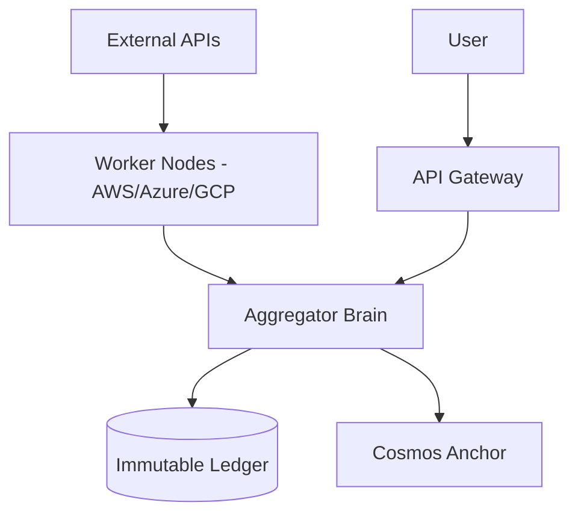

# AURUM Oracle

## A Multi-Cloud, Dual-Chain Gold Oracle

AURUM is a sovereign oracle network that aggregates real-world asset prices across AWS, Azure, and Google Cloud, anchoring every update to the Cosmos Blockchain for cryptographic certainty.

---

## Architecture

We shard consensus across physically separated cloud providers to eliminate single points of failure. Our proprietary Active Defense system protects the network from data corruption and hostile takeovers.



---

## Core Features

### Multi-Cloud Consensus
Three independent cloud providers voting on the price of Gold.

### Dual-Chain Verification
High-frequency internal ledger for sub-second latency, anchored to Cosmos for public finality.

### Active Defense
Automated sentinels detect tampering and self-heal corrupted binaries in real-time.

### Tiered Access
- **Free Tier**: Historical data for backtesting
- **Paid Tier**: Real-time streams for institutional use

---

## The V3 Revolution: 51% Immunity

Traditional blockchains (PoW/PoS) are vulnerable to 51% attacks because their security is static—limited by energy or capital.

AURUM V3 introduces the **Living Chain**:

1. **Detection**
2. **Response**
3. **Dilution**
4. **Neutralization**

This proprietary technology is currently under R&D.

---

## Join the Network

We are actively seeking partners to expand the ecosystem.

### For Validators

Help secure the network and earn rewards.

**Requirements:**
- Linux Server (Ubuntu 20.04+)
- 4GB RAM minimum

**Rewards:** Network participation incentives

**Get Started:** Contact us for the Validator Handbook

### For Data Clients

Access high-fidelity, multi-source gold data for your applications.

**Historical Data:** Available via our Free Tier API 

**Real-Time Data:** Enterprise-grade streams available for partners

**Integration:** See our API Documentation below

---

## Quick Start

### Prerequisites

- Go 1.21+
- Linux Server (Ubuntu 20.04+)

### Installation

Clone the repository:

```bash
git clone https://github.com/YOUR_USERNAME/aurum-oracle.git
cd aurum-oracle
```

Build binaries:

```bash
# Builds Node, Aggregator, and Gateway
go build -o bin/aurum-node cmd/oracle_node/main.go
go build -o bin/aurum-aggregator cmd/aggregator/main.go cmd/aggregator/aurum_core.go cmd/aggregator/cosmos_anchor.go
go build -o bin/aurum-gateway cmd/gateway/main.go
```

Run verification:

```bash
python3 aurum_verifier.py
```

---

## Security Demo

To simulate a 51% attack or hostile takeover, run the included penetration test suite:

```bash
./scripts/demo_attack.sh <TARGET_IP>
```

This script will:
- Verify consensus
- Attempt to inject malicious blocks (blocked by kernel)
- Attempt to delete binaries (restored by sentinel)

---

## License

see liscense file for details

## Contact

jeremyzieba@pm.me
